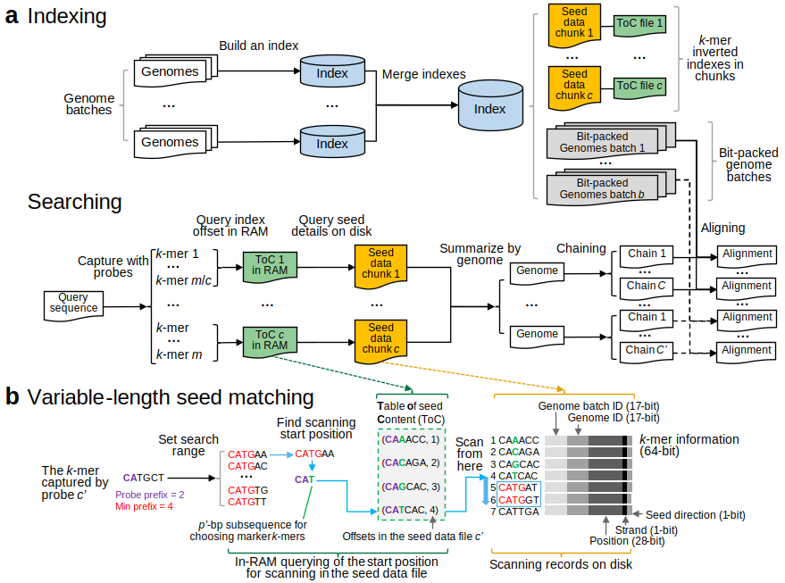

## <a href="https://bioinf.shenwei.me/LexicMap"></a> LexicMap: efficient sequence alignment against millions of prokaryotic genomes​

[](https://github.com/shenwei356/LexicMap/releases)
[](https://anaconda.org/bioconda/lexicmap)
[](http://bioinf.shenwei.me/LexicMap/installation/)
[](https://github.com/shenwei356/taxonkit/blob/master/LICENSE)

LexicMap is a **nucleotide sequence alignment** tool for efficiently querying gene, plasmid, viral, or long-read sequences against up to **millions of prokaryotic genomes**.

Documents: https://bioinf.shenwei.me/LexicMap

Preprint:

> Wei Shen and Zamin Iqbal.
> (2024) LexicMap: efficient sequence alignment against millions of prokaryotic genomes.
> bioRxiv. [https://doi.org/10.1101/2024.08.30.610459](https://doi.org/10.1101/2024.08.30.610459)

## Features

1. **LexicMap is scalable to up to millions of prokaryotic genomes**.
1. **The sensitivity of LexicMap is comparable with Blastn**.
1. **The alignment is [fast and memory-efficient](https://bioinf.shenwei.me/LexicMap/introduction/#searching)**.
1. LexicMap is **easy to [install](http://bioinf.shenwei.me/LexicMap/installation/),
   we provide [binary files](https://github.com/shenwei356/LexicMap/releases/)** with no dependencies for Linux, Windows, MacOS (x86 and arm CPUs).
2. LexicMap is **easy to use** ([tutorials](http://bioinf.shenwei.me/LexicMap/tutorials/index/) and [usages](http://bioinf.shenwei.me/LexicMap/usage/lexicmap/)). Both tabular and Blast-style output formats are available.
3. Besides, we provide [several commands](https://bioinf.shenwei.me/LexicMap/usage/utils/) to explore the index data and extract indexed subsequences.

## Introduction

**Motivation**: Alignment against a database of genomes is a fundamental operation in bioinformatics, popularised by BLAST.
However, given the increasing rate at which genomes are sequenced, **existing tools struggle to scale**.

1. Existing full alignment tools face challenges of high memory consumption and slow speeds.
1. Alignment-free large-scale sequence searching tools only return the matched genomes,
   without the vital positional information for downstream analysis.
1. Prefilter+Align strategies have the sensitivity issue in the prefiltering step.

**Methods**: ([algorithm overview](#algorithm-overview))

1. An [improved version](https://github.com/shenwei356/lexichash) of the sequence sketching method [LexicHash](https://doi.org/10.1093/bioinformatics/btad652) is adopted to compute alignment seeds accurately and efficiently.
    1. **We solved the [sketching deserts](https://www.biorxiv.org/content/10.1101/2024.01.25.577301v1) problem of LexicHash seeds to provide a [window guarantee](https://doi.org/10.1093/bioinformatics/btab790)**.
    2. **We added the support of suffix matching of seeds, making seeds much more tolerant to mutations**. Any 31-bp seed with a common ≥15 bp prefix or suffix can be matched, which means **seeds are immune to any single SNP**.
2. **A hierarchical index enables fast and low-memory variable-length seed matching** (prefix + suffix matching).
3. A pseudo alignment algorithm is used to find similar sequence regions from chaining results for alignment.
4. A [reimplemented](https://github.com/shenwei356/wfa) [Wavefront alignment algorithm](https://doi.org/10.1093/bioinformatics/btaa777) is used for base-level alignment.

**Results**:

1. LexicMap enables efficient indexing and searching of both RefSeq+GenBank and the [AllTheBacteria](https://www.biorxiv.org/content/10.1101/2024.03.08.584059v1) datasets (**2.3 and 1.9 million prokaryotic assemblies** respectively).
Running at this scale has previously only been achieved by [Phylign](https://github.com/karel-brinda/Phylign) (previously called mof-search), which compresses genomes with phylogenetic information and provides searching
(prefiltering with [COBS](https://github.com/iqbal-lab-org/cobs) and alignment with [minimap2](https://github.com/lh3/minimap2)).
1. For searching in all **2,340,672 Genbank+Refseq prokaryotic genomes**, *Blastn is unable to run with this dataset on common servers as it requires >2000 GB RAM*.  (see [performance](#performance)).
    
    **With LexicMap** (48 CPUs),

    |Query               |Genome hits|Time      |RAM    |
    |:-------------------|----------:|---------:|------:|
    |A 1.3-kb marker gene|37,164     |36 s      |4.1 GB |
    |A 1.5-kb 16S rRNA   |1,949,496  |10 m 41 s |14.1 GB|
    |A 52.8-kb plasmid   |544,619    |19 m 20 s |19.3 GB|
    |1003 AMR genes      |25,702,419 |187 m 40 s|55.4 GB|


More documents: https://bioinf.shenwei.me/LexicMap.

## Quick start

Building an index (see the tutorial of [building an index](http://bioinf.shenwei.me/LexicMap/tutorials/index/)).

    # From a directory with multiple genome files
    lexicmap index -I genomes/ -O db.lmi

    # From a file list with one file per line
    lexicmap index -X files.txt -O db.lmi

Querying (see the tutorial of [searching](http://bioinf.shenwei.me/LexicMap/tutorials/search/)).

    # For short queries like genes or long reads, returning top N hits.
    lexicmap search -d db.lmi query.fasta -o query.fasta.lexicmap.tsv \
        --min-qcov-per-hsp 70 --min-qcov-per-genome 70  --top-n-genomes 1000

    # For longer queries like plasmids, returning all hits.
    lexicmap search -d db.lmi query.fasta -o query.fasta.lexicmap.tsv \
        --min-qcov-per-hsp 0  --min-qcov-per-genome 0   --top-n-genomes 0


Sample output (queries are a few Nanopore Q20 reads). See [output format details](http://bioinf.shenwei.me/LexicMap/tutorials/search/#output-format).

    query                qlen   hits   sgenome           sseqid          qcovGnm   hsp   qcovHSP   alenHSP   pident    gaps   qstart   qend   sstart    send      sstr   slen
    ------------------   ----   ----   ---------------   -------------   -------   ---   -------   -------   -------   ----   ------   ----   -------   -------   ----   -------
    ERR5396170.1000016   740    1      GCF_013394085.1   NZ_CP040910.1   89.595    1     89.595    663       99.246    0      71       733    13515     14177     +      1887974
    ERR5396170.1000000   698    1      GCF_001457615.1   NZ_LN831024.1   85.673    1     85.673    603       98.010    5      53       650    4452083   4452685   +      6316979
    ERR5396170.1000017   516    1      GCF_013394085.1   NZ_CP040910.1   94.574    1     94.574    489       99.591    2      27       514    293509    293996    +      1887974
    ERR5396170.1000012   848    1      GCF_013394085.1   NZ_CP040910.1   95.165    1     95.165    811       97.411    7      22       828    190329    191136    -      1887974
    ERR5396170.1000038   1615   1      GCA_000183865.1   CM001047.1      64.706    1     60.000    973       95.889    13     365      1333   88793     89756     -      2884551
    ERR5396170.1000038   1615   1      GCA_000183865.1   CM001047.1      64.706    2     4.706     76        98.684    0      266      341    89817     89892     -      2884551
    ERR5396170.1000036   1159   1      GCF_013394085.1   NZ_CP040910.1   95.427    1     95.427    1107      99.729    1      32       1137   1400097   1401203   +      1887974
    ERR5396170.1000031   814    4      GCF_013394085.1   NZ_CP040910.1   86.486    1     86.486    707       99.151    3      104      807    242235    242941    -      1887974
    ERR5396170.1000031   814    4      GCF_013394085.1   NZ_CP040910.1   86.486    2     86.486    707       98.444    3      104      807    1138777   1139483   +      1887974
    ERR5396170.1000031   814    4      GCF_013394085.1   NZ_CP040910.1   86.486    3     84.152    688       98.983    4      104      788    154620    155306    -      1887974
    ERR5396170.1000031   814    4      GCF_013394085.1   NZ_CP040910.1   86.486    4     84.029    687       99.127    3      104      787    32477     33163     +      1887974
    ERR5396170.1000031   814    4      GCF_013394085.1   NZ_CP040910.1   86.486    5     72.727    595       98.992    3      104      695    1280183   1280777   +      1887974
    ERR5396170.1000031   814    4      GCF_013394085.1   NZ_CP040910.1   86.486    6     11.671    95        100.000   0      693      787    1282480   1282574   +      1887974
    ERR5396170.1000031   814    4      GCF_013394085.1   NZ_CP040910.1   86.486    7     82.064    671       99.106    3      120      787    1768782   1769452   +      1887974


CIGAR string, aligned query and subject sequences can be outputted as extra columns via the flag `-a/--all`.

    # Extracting similar sequences for a query gene.

    # search matches with query coverage >= 90%
    lexicmap search -d gtdb_complete.lmi/ b.gene_E_faecalis_SecY.fasta -o results.tsv \
        --min-qcov-per-hsp 90 --all

    # extract matched sequences as FASTA format
    sed 1d results.tsv | awk -F'\t' '{print ">"$5":"$14"-"$15":"$16"\n"$20;}' \
        | seqkit seq -g > results.fasta

    seqkit head -n 1 results.fasta | head -n 3
    >NZ_JALSCK010000007.1:39224-40522:-
    TTGTTCAAGCTATTAAAGAACGCCTTTAAAGTCAAAGACATTAGATCAAAAATCTTATTT
    ACAGTTTTAATCTTGTTTGTATTTCGCCTAGGTGCGCACATTACTGTGCCCGGGGTGAAT

Export blast-style format:

```
seqkit seq -M 500 q.long-reads.fasta.gz \
    | seqkit head -n 1 \
    | lexicmap search -d demo.lmi/ -a \
    | lexicmap utils 2blast --kv-file-genome ass2species.map

Query = GCF_006742205.1_r100
Length = 431

[Subject genome #1/1] = GCF_006742205.1 Staphylococcus epidermidis
Query coverage per genome = 92.575%

>NZ_AP019721.1
Length = 2422602

HSP #1
Query coverage per seq = 92.575%, Aligned length = 402, Identities = 98.507%, Gaps = 4
Query range = 33-431, Subject range = 1321677-1322077, Strand = Plus/Minus

Query  33       TAAAACGATTGCTAATGAGTCACGTATTTCATCTGGTTCGGTAACTATACCGTCTACTAT  92
                ||||||||||||||||||||||||||||||||||||||||||||||||||||||||||||
Sbjct  1322077  TAAAACGATTGCTAATGAGTCACGTATTTCATCTGGTTCGGTAACTATACCGTCTACTAT  1322018

Query  93       GGACTCAGTGTAACCCTGTAATAAAGAGATTGGCGTACGTAATTCATGTG-TACATTTGC  151
                |||||||||||||||||||||||||||||||||||||||||||||||||| |||||||||
Sbjct  1322017  GGACTCAGTGTAACCCTGTAATAAAGAGATTGGCGTACGTAATTCATGTGATACATTTGC  1321958

Query  152      TATAAAATCTTTTTTCATTTGATCAAGATTATGTTCATTTGTCATATCACAGGATGACCA  211
                |||||||||||||||||||||||||||||||||||||||||||||||||| |||||||||
Sbjct  1321957  TATAAAATCTTTTTTCATTTGATCAAGATTATGTTCATTTGTCATATCAC-GGATGACCA  1321899

Query  212      TGACAATACCACTTCTACCATTTGTTTGAATTCTATCTATATAACTGGAGATAAATACAT  271
                ||||||||||||||||||||||||||||||||||||||||||||||||||||||||||||
Sbjct  1321898  TGACAATACCACTTCTACCATTTGTTTGAATTCTATCTATATAACTGGAGATAAATACAT  1321839

Query  272      AGTACCTTGTATTAATTTCTAATTCTAA-TACTCATTCTGTTGTGATTCAAATGGTGCTT  330
                |||||||||||||||||||||||||||| ||||||||||||||||||||||||| |||||
Sbjct  1321838  AGTACCTTGTATTAATTTCTAATTCTAAATACTCATTCTGTTGTGATTCAAATGTTGCTT  1321779

Query  331      CAATTTGCTGTTCAATAGATTCTTTTGAAAAATCATCAATGTGACGCATAATATAATCAG  390
                |||||||||||||||||||||||||||||||||||||||||||||||||||||| |||||
Sbjct  1321778  CAATTTGCTGTTCAATAGATTCTTTTGAAAAATCATCAATGTGACGCATAATATCATCAG  1321719

Query  391      CCATCTTGTT-GACAATATGATTTCACGTTGATTATTAATGC  431
                |||||||||| |||||||||||||||||||||||||||||||
Sbjct  1321718  CCATCTTGTTTGACAATATGATTTCACGTTGATTATTAATGC  1321677


```


Learn more [tutorials](http://bioinf.shenwei.me/LexicMap/tutorials/index/) and [usages](http://bioinf.shenwei.me/LexicMap/usage/lexicmap/).

## Performance

See [performance](https://bioinf.shenwei.me/LexicMap/introduction/#performance).

## Installation

LexicMap is implemented in [Go](https://go.dev/) programming language,
executable binary files **for most popular operating systems** are freely available
in [release page](https://github.com/shenwei356/lexicmap/releases).

Or install with `conda`:

    conda install -c bioconda lexicmap

## Algorithm overview



## Citation

Wei Shen and Zamin Iqbal.
(2024) LexicMap: efficient sequence alignment against millions of prokaryotic genomes.
bioRxiv. [https://doi.org/10.1101/2024.08.30.610459](https://doi.org/10.1101/2024.08.30.610459)

## Terminology differences

- In the LexicMap source code and command line options, the term **"mask"** is used, following the terminology in the LexicHash paper.
- In the LexicMap manuscript, however, we use **"probe"** as it is easier to understand.
  Because these masks, which consist of thousands of k-mers and capture k-mers from sequences through prefix matching, function similarly to DNA probes in molecular biology.

## Support

Please [open an issue](https://github.com/shenwei356/LexicMap/issues) to report bugs,
propose new functions or ask for help.

## License

[MIT License](https://github.com/shenwei356/LexicMap/blob/master/LICENSE)


## Related projects

- High-performance [LexicHash](https://github.com/shenwei356/LexicHash) computation in Go.
- [Wavefront alignment algorithm (WFA) in Golang](https://github.com/shenwei356/wfa).
