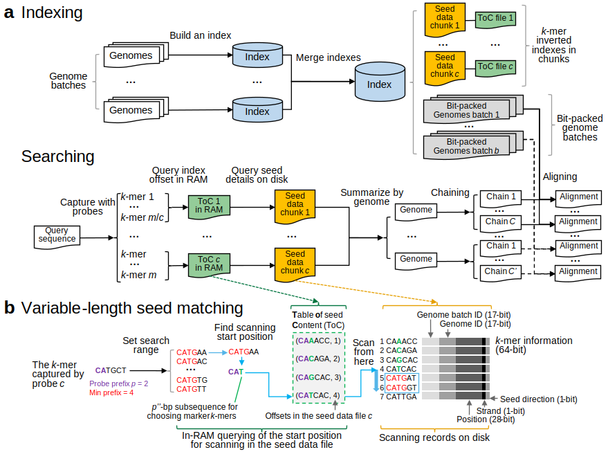

##  LexicMap: efficient sequence alignment against millions of prokaryotic genomes​

LexicMap is a sequence alignment tool aiming to query gene or plasmid sequences efficiently against up to millions of prokaryotic genomes.

For example, **querying a 51.5-kb plasmid in all 2,340,672 Genbank+Refseq prokaryotic genomes takes only 3 minutes and 32 seconds with 15.7 GB RAM and 48 CPUs, with 19,265 genome hits returned**.
By contrast, BLASTN is unable to run with the same dataset on common servers because it requires >2000 GB RAM. See [performance](#performance).

LexicMap uses a modified [LexicHash](https://doi.org/10.1093/bioinformatics/btad652) algorithm, which supports variable-length substring matching rather than classical fixed-length k-mers matching, to compute seeds for sequence alignment and uses multiple-level storage for fast and low-memory quering of seeds data. See [algorithm overview](#algorithm-overview).

LexicMap is easy to [install](http://bioinf.shenwei.me/lexicmap/installation/) (a binary file with no dependencies) and use ([tutorials](http://bioinf.shenwei.me/lexicmap/tutorials/index/) and [usages](http://bioinf.shenwei.me/lexicmap/usage/lexicmap/)).

## Quick start

Building an index (see the tutorial of [building an index](http://bioinf.shenwei.me/lexicmap/tutorials/index/)).

    # From a directory with multiple genome files
    lexicmap index -I genomes/ -O db.lmi

    # From a file list with one file per line
    lexicmap index -X files.txt -O db.lmi

Querying (see the tutorial of [searching](http://bioinf.shenwei.me/lexicmap/tutorials/search/)).

    # For short queries like genes or long reads, returning top N hits.
    lexicmap search -d db.lmi query.fasta -o query.fasta.lexicmap.tsv \
        --min-qcov-per-genome 70 --min-match-pident 70 --min-qcov-per-hsp 70 --top-n-genomes 500

    # For longer queries like plasmids, returning all hits.
    lexicmap search -d db.lmi query.fasta -o query.fasta.lexicmap.tsv \
        --min-qcov-per-genome 50 --min-match-pident 70 --min-qcov-per-hsp 0  --top-n-genomes 0

Sample output (queries are a few Nanopore Q20 reads). See [output format details](http://bioinf.shenwei.me/lexicmap/tutorials/search/#output).

    ━━━━━━━━━━━━━━━━━━━━━━━━━━━━━━━━━━━━━━━━━━━━━━━━━━━━━━━━━━━━━━━━━━━━━━━━━━━━━━━━━━━━━━━━━━━━━━━━━━━━━━━━━━━━━━━━━━━━━━━━━━━━━━━━━━━━━━━━━━━━━━━━━━━━━━━━━━━━━━━━━━━━━━━━━━━━━━━━━━━━━━━━━━━━━━━━━━━━━━━━━━━━━━━━━━━━━━━━━━━━━━━
     query                qlen   qstart   qend   sgnms   sgnm              seqid               qcovGnm   hsp   qcovHSP   alenHSP   alenSeg    pident    slen      sstart    send      sstr   seeds   species
    -------------------------------------------------------------------------------------------------------------------------------------------------------------------------------------------------------------------------------
     ERR5396170.1000016   740    71       733    1       GCF_013394085.1   NZ_CP040910.1       89.595    1     89.595    663       663        98.492    1887974   13515     14177     +      19      Limosilactobacillus fermentum
     ERR5396170.1000017   516    27       514    1       GCF_013394085.1   NZ_CP040910.1       94.574    1     94.574    488       488        100.000   1887974   293509    293996    +      6       Limosilactobacillus fermentum
     ERR5396170.1000029   480    37       474    1       GCF_001027105.1   NZ_CP011526.1       91.042    1     91.042    437       437        95.423    2755072   821078    821514    +      1       Staphylococcus aureus
     ERR5396170.1000047   960    24       812    2       GCF_001027105.1   NZ_CP011526.1       91.979    1     91.979    883       803        89.015    2755072   2204718   2205520   -      7       Staphylococcus aureus
     ERR5396170.1000047   960    881      960    2       GCF_001027105.1   NZ_CP011526.1       91.979    1     91.979    883       80         89.015    2755072   2204568   2204647   -      7       Staphylococcus aureus
     ERR5396170.1000047   960    42       960    2       GCF_002902405.1   NZ_PPQS01000020.1   100.000   1     97.500    936       936        77.457    50421     25900     26835     +      3       Staphylococcus schweitzeri
     ERR5396170.1000047   960    42       950    2       GCF_002902405.1   NZ_PPQS01000020.1   100.000   2     96.458    926       926        77.214    50421     25900     26825     +      1       Staphylococcus schweitzeri
     ERR5396170.1000000   698    53       650    1       GCF_001457615.1   NZ_LN831024.1       86.390    1     86.390    603       603        96.517    6316979   4452083   4452685   +      4       Pseudomonas aeruginosa
     ERR5396170.1000005   2516   38       2510   5       GCF_000006945.2   NC_003197.2         98.490    1     98.490    2478      2478       98.951    4857450   3198806   3201283   +      14      Salmonella enterica
     ERR5396170.1000005   2516   38       2497   5       GCF_008692785.1   NZ_VXJV01000001.1   98.013    1     98.013    2466      2466       95.864    797633    423400    425865    +      8       Salmonella enterica
     ERR5396170.1000005   2516   40       2510   5       GCA_900478215.1   LS483478.1          98.450    1     98.450    2477      2477       95.317    4624613   785866    788342    -      12      Salmonella enterica
     ERR5396170.1000005   2516   1350     2497   5       GCF_008692845.1   NZ_VXJW01000004.1   87.599    1     87.599    2204      1151       91.742    366711    6705      7855      +      9       Salmonella enterica
     ERR5396170.1000005   2516   634      1309   5       GCF_008692845.1   NZ_VXJW01000004.1   87.599    1     87.599    2204      674        91.742    366711    5991      6664      +      9       Salmonella enterica
     ERR5396170.1000005   2516   387      608    5       GCF_008692845.1   NZ_VXJW01000004.1   87.599    1     87.599    2204      221        91.742    366711    5745      5965      +      9       Salmonella enterica
     ERR5396170.1000005   2516   69       205    5       GCF_008692845.1   NZ_VXJW01000004.1   87.599    1     87.599    2204      138        91.742    366711    5426      5563      +      9       Salmonella enterica
     ERR5396170.1000005   2516   306      325    5       GCF_008692845.1   NZ_VXJW01000004.1   87.599    1     87.599    2204      20         91.742    366711    5664      5683      +      9       Salmonella enterica
    ━━━━━━━━━━━━━━━━━━━━━━━━━━━━━━━━━━━━━━━━━━━━━━━━━━━━━━━━━━━━━━━━━━━━━━━━━━━━━━━━━━━━━━━━━━━━━━━━━━━━━━━━━━━━━━━━━━━━━━━━━━━━━━━━━━━━━━━━━━━━━━━━━━━━━━━━━━━━━━━━━━━━━━━━━━━━━━━━━━━━━━━━━━━━━━━━━━━━━━━━━━━━━━━━━━━━━━━━━━━━━━━
    Note: the column `species` is added by mapping genome ID (column `sgnm`) to taxonomic information.

Learn more [tutorials](http://bioinf.shenwei.me/lexicmap/tutorials/index/) and [usages](http://bioinf.shenwei.me/lexicmap/usage/lexicmap/).

## Performance

|dataset          |genomes  |query          |query_len|genome_hits|time    |RAM    |
|:----------------|--------:|:--------------|--------:|----------:|-------:|------:|
|GTDB repr        |85,205   |a MutL gene    |1,956 bp |2          |0.9 s   |460 MB |
|                 |         |a 16S rRNA gene|1,542 bp |13,466     |4.0 s   |765 MB |
|                 |         |a plasmid      |51,466 bp|2          |1.1 s   |752 MB |
|GTDB complete    |402,538  |a MutL gene    |1,956 bp |268        |3.8 s   |544 MB |
|                 |         |a 16S rRNA gene|1,542 bp |169,480    |2 m 14 s|2.9 GB |
|                 |         |a plasmid      |51,466 bp|3,649      |56 s    |2.9 GB |
|Genbank+RefSeq   |2,340,672|a MutL gene    |1,956 bp |817        |10.0 s  |2.3 GB |
|                 |         |a 16S rRNA gene|1,542 bp |1,148,049  |5 m 34 s|11.8 GB|
|                 |         |a plasmid      |51,466 bp|19,265     |3 m 32 s|15.7 GB|
|AllTheBacteria HQ|1,858,610|a MutL gene    |1,956 bp |404        |18.7 s  |2.4 GB |
|                 |         |a 16S rRNA gene|1,542 bp |1,193,874  |13 m 8 s|9.4 GB |
|                 |         |a plasmid      |51,466 bp|10,954     |5 m 25 s|9.7 GB |

Notes:
- All files are stored on a server with HDD disks.
- Tests are performed in a single cluster node with 48 CPU cores (Intel Xeon Gold 6336Y CPU @ 2.40 GHz).
- Index building parameters: `-k 31 -m 40000`. Genome batch size: `-b 10000` for GTDB datasets, `-b 131072` for others.
- Searching parameters: `--top-n-genomes 0 --min-qcov-per-genome 50 --min-match-pident 70 --min-qcov-per-hsp 0`.

## Installation

LexicMap is implemented in [Go](https://go.dev/) programming language,
executable binary files **for most popular operating systems** are freely available
in [release](https://github.com/shenwei356/lexicmap/releases) page.

Or install with `conda`:

    conda install -c bioconda lexicmap

## Algorithm overview

## Related projects

- High-performance [LexicHash](https://github.com/shenwei356/LexicHash) computation in Go.

## Support

Please [open an issue](https://github.com/shenwei356/LexicMap/issues) to report bugs,
propose new functions or ask for help.

## License

[MIT License](https://github.com/shenwei356/LexicMap/blob/master/LICENSE)

